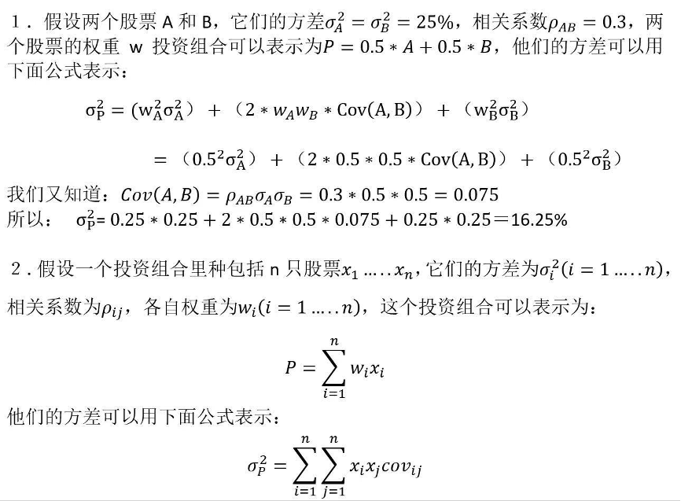
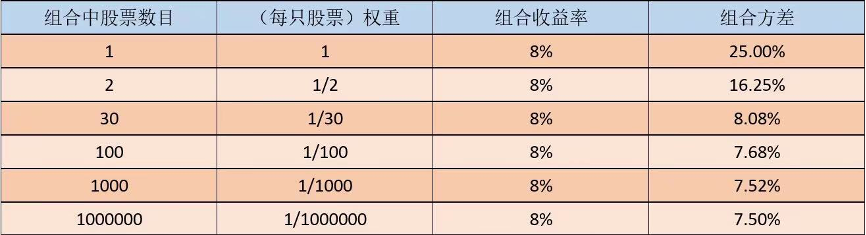

---
问题分析：投资组合
---

# 场景描述
 
 

# 思考问题
1.	股票的价格随着时间波动，方差和组合方差在现实中代表什么？
2.	上面的例子能给我们什么样的决策建议？你觉得生活中还有哪些场景可以应用相同的决策？
3.	如果上例中每只股票的收益率和方差各不相同，你觉得如何制定投资决策呢？

# 提交答案
1. 填写 [在线表格](https://docs.qq.com/form/page/DYk5WZm1yREttTWRU)
2. 或扫码
 