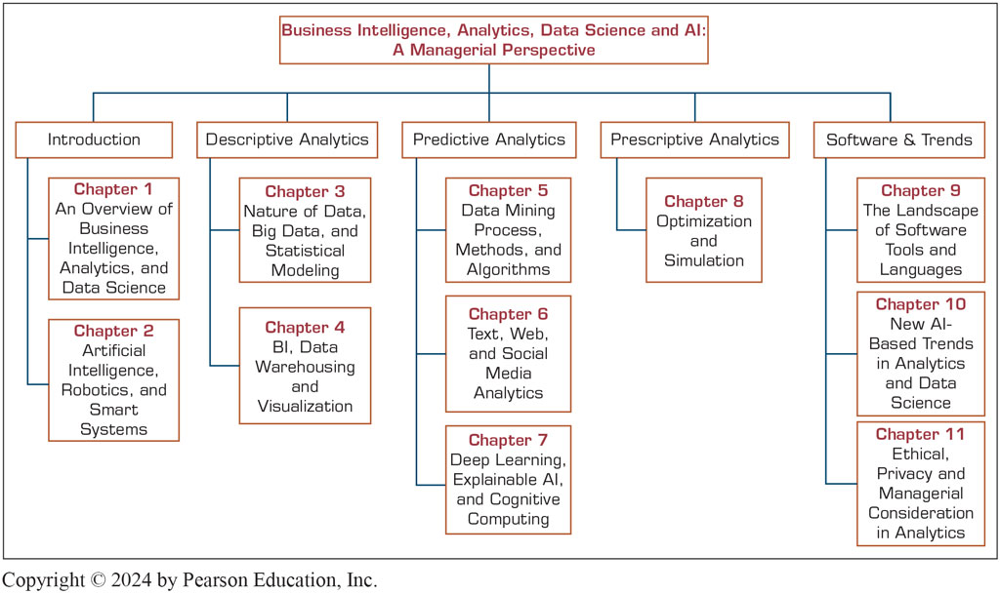

# 课程介绍

**DATA SCIENCE** combines the scientific method, math and statistics, specialized programming, advanced analytics, AI, and even storytelling to uncover and explain the business insights buried in data.

# 教材
* 教材名称：`Business Intelligence, Analytics, Data Science, And AI`, 5th Edition
* 出版社链接：[Pearson](https://www.pearson.com/en-us/subject-catalog/p/business-intelligence-analytics-data-science-and-ai/P200000009781?view=educator)
* 电子书：[Business Intelligence, Analytics, Data Science, And AI](https://docs.qq.com/pdf/DYnBabkRYaW9uV2VS)

# 课件
* Chapter 1：[An Overview of Business Intelligence, Analytics, and Data Science](https://docs.qq.com/slide/DYmRYWXNzeEd0Zkpi)
* Chapter 2：[Artificial Intelligence, Robotics, and Smart Systems](https://docs.qq.com/slide/DYmVjZ0NEakhsd3d0)
* Chapter 3：[Descriptive Analytics I: Nature of Data, Big Data and Statistical Modeling](https://docs.qq.com/slide/DYml3YUFOV1NIYmhF)
* Chapter 4：[Descriptive Analytics II: Business Intelligence, Data Warehousing, and Visualization](https://docs.qq.com/slide/DYkpOcUdRQ0RtcW1P)
* Chapter 5：[Predictive Analytics I: Data Mining Process, Methods, and Algorithms](https://docs.qq.com/slide/DYmFMYm5tck52cEJo)
* Chapter 6：[Predictive Analytics II: Text, Web, and Social Media Analytics](https://docs.qq.com/slide/DYk53TENVVmZIRGxo)
* Chapter 7：[Deep Learning and Cognitive Computing](https://docs.qq.com/slide/DYk1ubmRnekJCa1hS)

# 案例
* Application Case：[Making Elevators Go Faster!](https://f.nkugame.com/#/ApplicationCase/as1)
* Application Case：[Robots Took the Job of Camel-Racing Jockeys for Societal Benefits](https://f.nkugame.com/#/ApplicationCase/as2)
* Application Case：[Amazon Go Is Open for Business](https://f.nkugame.com/#/ApplicationCase/as3)
* Application Case：[Golden Ratio](https://youtu.be/UY2EFPSQYgE)

# 大纲

# 课后作业
- **作业6（2026年1月4日之前）**：[华为云空间：Docker安装Flink实现数据实时统计](https://f.nkugame.com/#/Practices/Problem6) 。
- **作业5（2025年12月26日之前）**：[华为云空间：基于Apache Spark实现商品推荐算法](https://f.nkugame.com/#/Practices/Problem5) 。
- **作业4（2025年12月19日之前）**：[华为云空间：基于 PyTorch 搭建多层感知机模型实现葡萄酒数据集分类](https://f.nkugame.com/#/Practices/Problem4) 。
- **作业3（2025年11月21日之前）**：[数据分析与可视化：城市租房数据](https://f.nkugame.com/#/Practices/Problem3) 。
- **作业2（2025年10月24日之前）**：[问题分析：投资组合](https://f.nkugame.com/#/Practices/Problem2) 。
- **作业1（2025年10月12日之前）**：组队报名参加[2025动感地带AI+高校创智计划](https://www.migufun.com/5gcampus/?pageId=102003) 大赛；提交参赛作品到竞赛平台后，同时将“作品创意文件”和“作品演示视频”提交到表单[《数据科学》作业 1](https://docs.qq.com/form/page/DYmJxbUZUV0ZiWktY)。