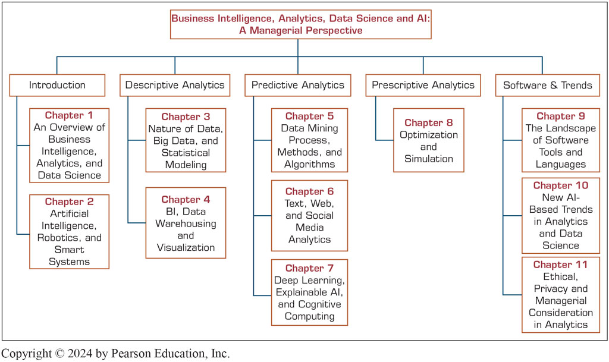

# 课程介绍

**数据科学：** 是一门综合学科，利用统计、计算机、领域知识，从数据里挖掘价值、发现规律、辅助决策。

**成绩构成：** 平时成绩占60%，课程报告占40%。

# 课程报告

**参加赛事：** [2026动感地带AI+高校创智计划](https://ai.migudm.cn/interactive/match/home)。

**作品提交：** 待定。

# 教材
* 教材名称：`Business Intelligence, Analytics, Data Science, And AI`, 5th Edition
* 出版社链接：[Pearson](https://www.pearson.com/en-us/subject-catalog/p/business-intelligence-analytics-data-science-and-ai/P200000009781?view=educator)
* 电子书：[Business Intelligence, Analytics, Data Science, And AI](https://docs.qq.com/pdf/DYnBabkRYaW9uV2VS)

# 课件
* Chapter 1：[An Overview of Business Intelligence, Analytics, and Data Science](https://docs.qq.com/slide/DYmRYWXNzeEd0Zkpi)
* Chapter 2：[Artificial Intelligence, Robotics, and Smart Systems](https://docs.qq.com/slide/DYmVjZ0NEakhsd3d0)
* Chapter 3：[Descriptive Analytics I: Nature of Data, Big Data and Statistical Modeling](https://docs.qq.com/slide/DYml3YUFOV1NIYmhF)
* Chapter 4：[Descriptive Analytics II: Business Intelligence, Data Warehousing, and Visualization](https://docs.qq.com/slide/DYkpOcUdRQ0RtcW1P)
* Chapter 5：[Predictive Analytics I: Data Mining Process, Methods, and Algorithms](https://docs.qq.com/slide/DYmFMYm5tck52cEJo)
* Chapter 6：[Predictive Analytics II: Text, Web, and Social Media Analytics](https://docs.qq.com/slide/DYk53TENVVmZIRGxo)
* Chapter 7：[Deep Learning and Cognitive Computing](https://docs.qq.com/slide/DYk1ubmRnekJCa1hS)

# 案例
* Application Case：[Making Elevators Go Faster!](https://f.nkugame.com/#/ApplicationCase/as1)
* Application Case：[Robots Took the Job of Camel-Racing Jockeys for Societal Benefits](https://f.nkugame.com/#/ApplicationCase/as2)
* Application Case：[Amazon Go Is Open for Business](https://f.nkugame.com/#/ApplicationCase/as3)
* Application Case：[Golden Ratio](https://youtu.be/UY2EFPSQYgE)

# 大纲

